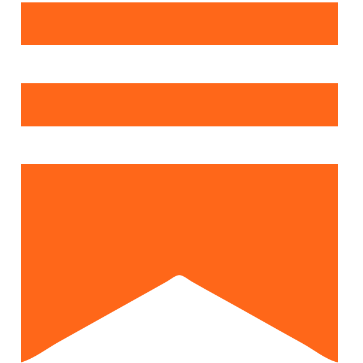

# About
Hi, my name is Isaac Kargar and I am the CIO and co-founder of [SUPPLYZ](https://www.supplyz.eu/). In addition to my professional endeavors, I am currently pursuing a PhD in the Intelligent Robotics Group at Aalto University in Finland. Outside of work, I enjoy traveling, going on walks, reading, listening to podcasts and music.

 [LinkedIn](https://www.linkedin.com/in/eshagh-kargar/)\
 [Twitter](https://twitter.com/kargarisaac)\
 [GitHub](https://github.com/kargarisaac)\
 [Medium](https://kargarisaac.medium.com/)\
 [Substack](https://kargarisaac.substack.com/)\
 [Email](mailto:kargarisaac@gmail.com)

